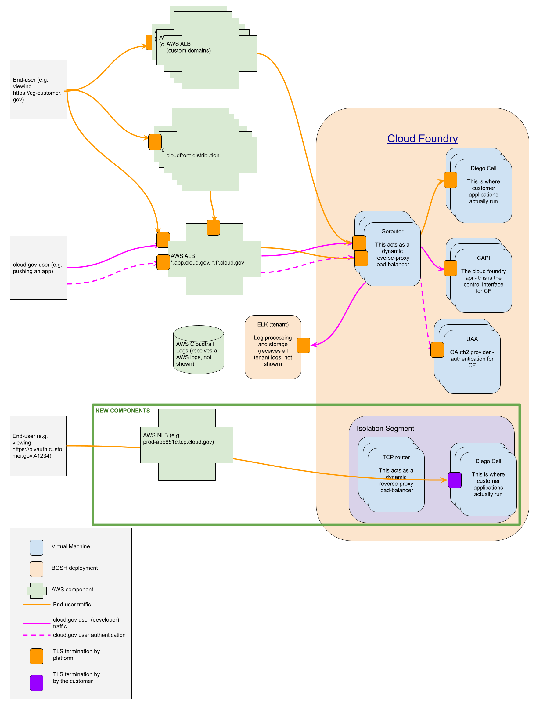

TCP Routing
===========

Why
---

Users have requested this for various reasons, but the most common
is that they want to offer PIV/CAC authentication without relying
on external services. PIV authentication requires TLS termination
by the PIV application, so terminating HTTPS at the router does not
work for this use case.

Currently, all traffic (for end-users and customers/developers)
into cloud.gov is over HTTPS with TLS termination at AWS ALB load
balancer. Traffic is then re-encrypted to the HTTP Router, and from
the HTTP Router to the Application Instance in the corresponding
Diego Cell.

This proposed change allows developers to manage the end-user traffic
to their application at the TCP layer, so customers on cloud.gov
PaaS can provide services that aren't compatible with a pure
HTTPS-only approach.

Version History
---------------

The full document history is available through commit history, but major updates
include:

* 2022-02-08: Initial version by Ben Berry
* 2022-07-15: Major update to support Significant Change Request (SCR), adding images, by Peter Burkholder
  and Ben Berry

The Plan
--------

### Architecture

We'll add

-   at least one AWS NLB, each NLB having multiple listeners

-   three tcp-routers

-   five diego cells

The new diego cells will be in a new isolation segment, and the new
gorouters will be dedicated to that segment, with the AWS NLB in
front of them. There will be exactly one new isolation segment,
shared by all tcp-route users. Each customer will get one dedicated
NLB with a to-be-determined number of ports, more than one, fewer
than 51. The number of ports per ALB is configured via a global
variable; customers needing more will need/get additional NLBs (at
additional cost).

The diagram below illustrates at a high level the current data flow and new end-user data flow and supporting components.

#### End-user and Developer Data Flow

### New or Added Components

#### AWS NLB (Network Load Balancer)

-   Type:  AWS Network Component

-   Baseline configuration: Not applicable. There's no operating system to manage for this AWS component

-   Configuration settings: Manage via infra-as-code at:
https://github.com/cloud-gov/cg-provision/blob/main/terraform/modules/cloudfoundry/nlb.tf

-   Ports / Protocols / Services: 

-   TCP only (no UDP)

-   Ports are managed by Cloud Operations to match target ports on
TCP Routers. Ports will be in the 40000-41000 range

-   No services offered directly

-   Access control: There's no direct access to AWS NLBs. Access
to the APIs for managing NLBs via already established AWS IAM.

-   Auditing/Logging: NLBs API events are logged into AWS Cloudtrail,
and are managed identically to other AWS API events. Traffic is
logged and stored in AWS CloudTrail Logs using the same mechanisms
as our other load balancers.

#### Cloud Foundry Isolation Segment

-   Type: Isolation segments are a logical construct within Cloud
Foundry to allow workload components, such as compute nodes (Diego
Cells), to run on a set of distinct subnets from other isolation
segments or the shared-tenancy components.

-   Baseline configuration: Not applicable. There's no host operating system for an isolation segment.

-   Configuration settings: Managed through our infrastructure as code at 

-   <https://github.com/cloud-gov/cg-deploy-cf/blob/main/terraform/modules/tcp-routing/routing.tf>

-   <https://github.com/cloud-gov/cg-deploy-cf/blob/main/bosh/opsfiles/tcp-cells-and-routers.yml>

-   Port / Protocols / Services: Not applicable

-   Access control: Cloud Operations assigns a cloud.gov customer
Org Manager the access to an isolation segment. The Org Manager is
then responsible for creating spaces within the isolation segment,
then assigning "Space Developers" to those spaces.

-   Auditing/Logging: Isolation segment create/read/update/deletion
events are logged as Cloud Foundry audit events, already under our
management. The cloud.gov customers within the isolation segment
can

#### TCP Routers

-   Type: BOSH-managed virtual machine

-   Baseline configuration: Share the same baseline as all other
BOSH-managed VMs with the cloud.gov infrastructure

-   Configuration setting: Managed through our infra as code at: <https://github.com/cloud-gov/cg-deploy-cf/blob/main/bosh/opsfiles/tcp-cells-and-routers.yml#L5-L51>

-   Ports / Protocols / Services:  

-   Ports: We configure the TCP routers to listen on a range of
high-numbered ports that match the target destination ports on the
front-end NLBs. The TCP routers then route that traffic to destination
Diego cells.

-   Protocol: TCP only

-   Services: No services offered directly

-   Access control: There's no direct access to the TCP routers
except by Cloud Operations

-   Auditing/Logging: TCP routers share the same audit & logging
as our GoRouters. All traffic through the TCP router for a cloud.gov
tenant is tagged with the corresponding metadata and available to
the tenant at our logging service: <https://logs.fr.cloud.gov>, or
can be "drained" to the customer-designated endpoint.

#### Diego Cells (Isolation segment specific)

-   Type: BOSH-managed virtual machine

-   Baseline configuration: Share the same baseline as all other
BOSH-managed VMs with the cloud.gov infrastructure

-   Configuration setting: Managed identically with all other Diego
cells, except for their attachment to the Isolation Segment subnet.

-   Ports / Protocols / Services:  Identical to existing Diego cells.

-   Access control: Identical to existing Diego cells. There's no
direct access to except by Cloud Operations, tenants only have
access to run workloads (via cf push) or to connect to their running
containers (via cf ssh); they have no direct access to the cell
itself.

-   Auditing/Logging: Identical to other Diego cells.

### Usage

Isolation segments are allowed/disallowed at an organization level
and assigned on a space level, so an organization can have many
isolation segments mapped to it, but a space is mapped to exactly
one isolation segment.

By default, nobody should have access to this isolation segment.
When customers are onboarded to the isolation segment, they should
be strongly cautioned about the lack of TLS enforcement and potential
compliance implications -- this will be reflected on our updated
CIS/CRM. Customers should create one or more spaces on the tcp
isolation segment. We should advise that only applications requiring
direct TCP access be run in the space, and that applications within
those spaces should have TLS termination.

### Customer experience

cloud.gov PaaS customers are assigned one Cloud Foundry "organization"
per logical system (and agreement). Customers need to designate at
least one user as the Org Manager. A customer needing the TCP routes
feature should have their Org Manager request that feature via a
support request for "TCP routing", and they'll be allocated one AWS
NLB with 10 routes (and expandable to 50 on request).

Once TCP Routes is enabled for the organization, the OrgManager
will delegate them to the space, and in the space Devs will use `cf
routes` to associate routes to apps. The customer documentation for
this will be on cloud.gov, with reference to the standard Cloud
Foundry documentation.

During development, these ports will be available as either the full AWS NLB FQDN:

    production-cf-tcp-0-abb851c50ddac04d.elb.us-gov-west-1.amazonaws.com

or as the cloud.gov shorthand address:

    prod-abb851c.tcp.cloud.gov

The names used will not be iterable nor directly associated with any customer.

When the customer is ready for production, their agency DNS
administrators will have to create CNAME (or static A records for
the DNSSEC use case) to the AWS NLB in use for this service

#### End-user experience

End users will be redirected to a service on a high-numbered port,
e.g. identity.agency.gov:41114 and that will connect mTLS to the
developer's back-end apps. Since End Users will use the agency-designated
DNS then that will provide host validatation (DNSSEC and/or HTTPS/HSTS)

### Deletion and clean-up

The NLB name + port assigned to a customer will not be recycled.

### Pricing

We should have a setup fee to recover our time spent configuring
access, and a recurring monthly fee to recover our maintenance,
monitoring, and infrastructure/AWS costs. This fee should include
a (to be determined) number of routes (each route corresponds to
one port). Additional routes should be available for an additional
monthly cost, but without an additional setup fee.

Other Considerations
--------------------

### Open questions

-   how many routes come in a pack? Three should allow for dev, stage, and production, assuming apps that require only one route each

-   what is an appropriate cost? Consider:

-   the time we spend implementing this (setup fee)

-   the time and cost of SCR/3PAO assessment (setup fee)

-   the increased maintenance of a more complex system (maintenance fee)

-   the infrastructure costs (maintenance fee)

-   can/should we run any enforcement of TCP routes only in the new isolation segment?

-   can/should we run any checks for TLS on TCP routes?

### Scaling

Adding isolation segments complicates our scaling considerations.
This highlights that we should have a better story around scaling
up and down as conditions change. This shouldn't be a blocker for
implementation, but we should be mindful of this and address it
soon. Autoscaling would be nice, but we should start with setting
some service level objectives and correlating them to components.

Challenges
----------

### Incompatibility with mTLS

Currently, we have mTLS configured between the gorouters and diego
cells. Cloud Foundry doesn't differentiate TCP routes from HTTPS
routes in that configuration, so having mTLS and TCP routes are
mutually exclusive. We can work around this by having an isolation
segment dedicated to tcp routes and a dedicated set of gorouters
as well.

While CF does support X-Forwarded-Client-Cert (XFCC), that's for
mTLS between applications and not between end-user and back-end
applications.

### Scarce Shared Resource

Because TCP routes don't consider names in their routing decision, the number
of available routes is much smaller, and much more difficult to increase. We
can combat this primarily with quotas and pricing. By charging appropriately
for TCP routes, we recover the cost of scaling and disincentivize misuse.k

