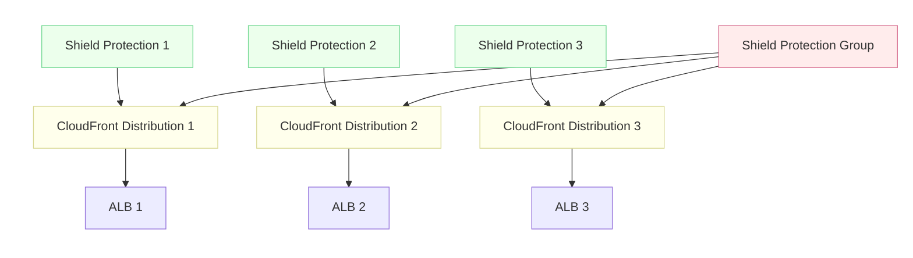

# CloudFront and Shield Advanced

## Why

To mitigate the impact of DDoS attacks, we want to enable AWS Shield Advanced, Amazon's DDoS protection product. Shield Advanced is not available in GovCloud[^1] and cannot protect GovCloud load balancers from a Commercial account[^2][^3]. To use it, we will create CloudFront distributions in our Commercial AWS account, point them at our production load balancers in GovCloud, and enable Shield Advanced on the distributions[^4].

[^1]: https://aws.amazon.com/about-aws/global-infrastructure/regional-product-services/
[^2]: The GovCloud partition is logically separated at the network level from other partitions: https://docs.aws.amazon.com/govcloud-us/latest/UserGuide/govcloud-differences.html
[^3]: https://gsa-tts.slack.com/archives/C03P214FD9R/p1664300899870519
[^4]: "CloudFront is not available in AWS GovCloud (US), but you can use CloudFront in the standard regions and point to your AWS GovCloud (US) resources". https://docs.aws.amazon.com/govcloud-us/latest/UserGuide/setting-up-cloudfront.html

## Background: How CloudFront and Shield Advanced Work

[CloudFront](https://docs.aws.amazon.com/AmazonCloudFront/latest/DeveloperGuide/Introduction.html) is AWS's Content Delivery Network (CDN) product. It is comprised of a globally distributed network of edge locations and is meant to speed up content delivery by serving cached content from locations geographically close to users. CloudFront distributions tell CloudFront which origin servers to use and are associated with a domain name.

[Shield Advanced](https://docs.aws.amazon.com/waf/latest/developerguide/ddos-advanced-summary.html) is a tier of AWS Shield, a DDoS protection service. Shield Advanced automatically creates Web Application Firewall (WAF) rules in response to changing traffic to block requests that are part of a DDoS attack. Shield Advanced can be enabled on [certain AWS resource types](https://docs.aws.amazon.com/waf/latest/developerguide/ddos-advanced-summary-protected-resources.html), including CloudFront distributions.

## Implementation

The following only applies to our production environment. All other environments are not available on the public internet and cannot be targeted by DDoS attacks.

We will use Terraform in `cg-provision` to do the following:

* Create CloudFront distributions in front of all internet-facing load balancers.
    * Use the [aws_cloudfront_distribution](https://registry.terraform.io/providers/hashicorp/aws/latest/docs/resources/cloudfront_distribution) Terraform resource.
    * Per the [AWS docs](https://docs.aws.amazon.com/govcloud-us/latest/UserGuide/setting-up-cloudfront-tips.html), we will set up CloudFront to distribute content from a custom origin server.
    * See also the [aws_lb](https://registry.terraform.io/providers/hashicorp/aws/latest/docs/resources/lb) resource and [aws_elb](https://registry.terraform.io/providers/hashicorp/aws/latest/docs/resources/elb) resource.
        * We mostly use ALBs, except for four "classic" ELBs. Three of those are internal.
    * A single distribution can point to [up to 25 origins](https://docs.aws.amazon.com/AmazonCloudFront/latest/DeveloperGuide/distribution-overview.html), but seems to be associated with a single domain. So the number of distributions we will need is 1:1 with either the number of load balancers or the number of domains, in the case that multiple load balancers support a single domain.
    * For reference, a single AWS account has a default quota of [200 distributions](https://docs.aws.amazon.com/AmazonCloudFront/latest/DeveloperGuide/cloudfront-limits.html#limits-web-distributions).
* Enable Shield Advanced on the new CloudFront distributions.
    * Use the [aws_shield_protection](https://registry.terraform.io/providers/hashicorp/aws/latest/docs/resources/shield_protection) resource. One per protected resource (CloudFront distribution, in this case).
    * Add a [aws_shield_protection_group](https://registry.terraform.io/providers/hashicorp/aws/latest/docs/resources/shield_protection_group) resource so traffic is analyzed across all resources.
* Change DNS to reference CloudFront distributions instead of the load balancers.
    * Relevant resource type is [aws_route53_record](https://registry.terraform.io/providers/hashicorp/aws/latest/docs/resources/route53_record).
* Configure our LBs to only accept traffic from CloudFront using [custom headers](https://docs.aws.amazon.com/AmazonCloudFront/latest/DeveloperGuide/private-content-overview.html#forward-custom-headers-restrict-access). Without this step, attackers could make requests to our load balancers directly, bypassing CloudFront and Shield Advanced.

Notes:

* Even though the final implementation will only be run in production, it's possible we could implement the change in the staging or development environments to test it.
    * I'm not sure if we can do this, since that environment is not exposed to the internet.
    * If not: I plan to enable CloudFront alongside the current system, leaving existing DNS as-is, and test with the CloudFront-generated domains before switching DNS.
* CloudFront being outside the GovCloud security boundary will have implications for the related compliance work.

## Open Questions

* We'd like to put this protection in front of our customers' applications. What if they are already using a CDN? Can we replace it in-place if it was set up via the [External Domain Broker](https://github.com/cloud-gov/external-domain-broker)?
