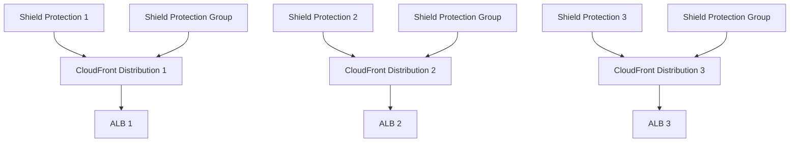

# CloudFront and Shield Advanced

## Why

To mitigate the impact of DDoS attacks, we want to enable AWS Shield Advanced, Amazon's DDoS protection product. Shield Advanced is not available in GovCloud and cannot protect GovCloud load balancers from a Commercial account. To use it, we will create CloudFront distributions in our Commercial AWS account in front of all platform load balancers, and enable Shield Advanced on CloudFront.

## How CloudFront and Shield Advanced work

[CloudFront](https://docs.aws.amazon.com/AmazonCloudFront/latest/DeveloperGuide/Introduction.html) is AWS's Content Delivery Network (CDN) product. It is comprised of a globally distributed network of edge locations and is meant to speed up content delivery by serving cached content from locations geographically close to users. CloudFront distributions tell CloudFront which origin servers to use and are associated with a domain name.

[Shield Advanced](https://docs.aws.amazon.com/waf/latest/developerguide/ddos-advanced-summary.html) is a tier of AWS Shield, a DDoS protection service. Shield Advanced automatically creates Web Application Firewall (WAF) rules in response to changing traffic to block requests that are part of a DDoS attack. Shield Advanced can be enabled on [certain AWS resource types](https://docs.aws.amazon.com/waf/latest/developerguide/ddos-advanced-summary-protected-resources.html), including CloudFront distributions.

## Implementation

The following only applies to our production environment. All other environments are not available on the public internet and cannot be targeted by DDoS attacks.

* Use Terraform to create CloudFront distributions in front of all load balancers.
    * Use the [aws_cloudfront_distribution] Terraform resource.
* Enable Shield Advanced on the new distributions.
    * Use the `aws_shield_protection` resource. One per protected resource.
    * Add a `aws_shield_protection_group` resource so traffic is compared across all resources.
* Change DNS to reference CloudFront distributions
    * Can we put this protection in front of our customers' applications? What if they are using a CDN themselves?

Even though the final implementation will only be run in production, we could implement the change in the development environment to test it.

### Security Impact

## Open questions
