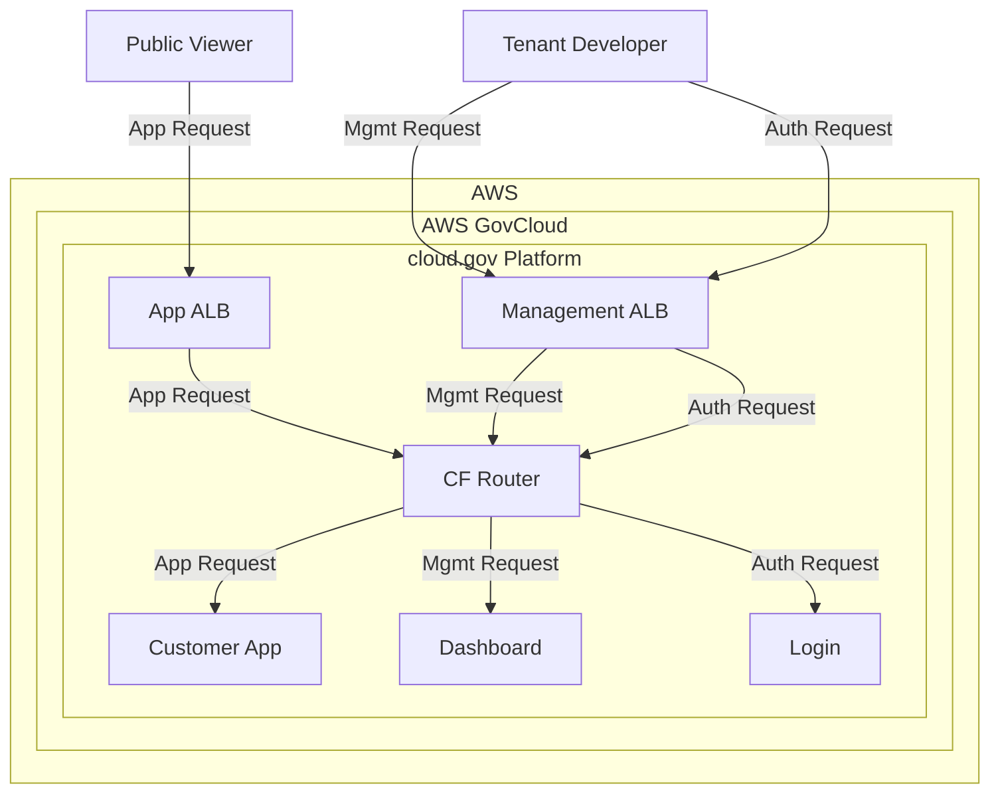
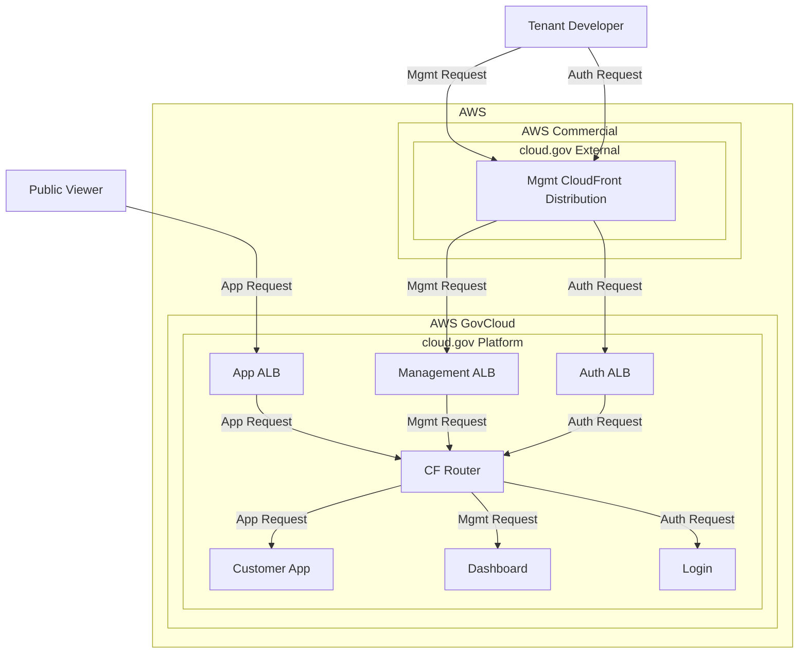
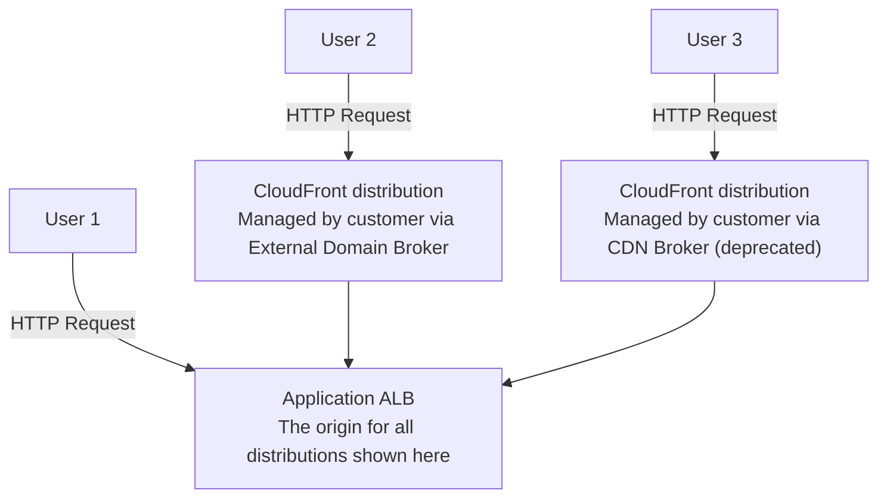
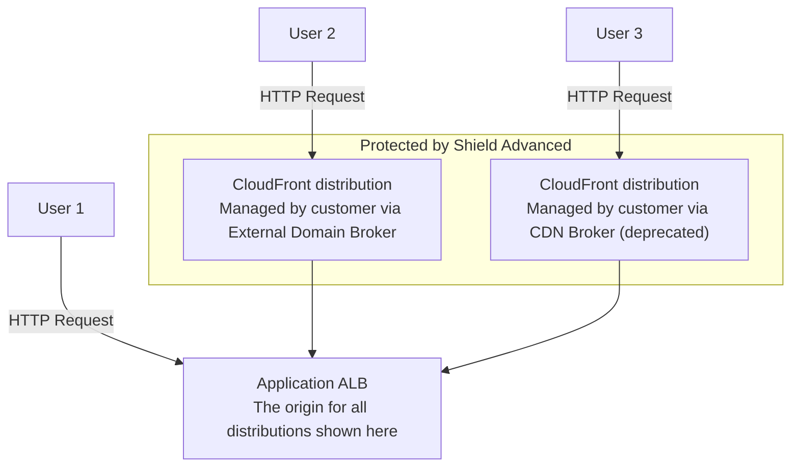

# DDoS Mitigation: WAF and Shield Advanced

## Why

Cloud.gov is periodically targeted by high-volume Layer 7 vulnerability scans from unknown actors. The scans are comprised of HTTP requests that attempt to exploit well-known security vulnerabilities, like retrieving `/etc/passwd` files left exposed on servers. The volume of traffic is sometimes large enough to overwhelm networking components of cloud.gov and bring the platform offline. The traffic typically comes from many hosts, each making a relatively small number of requests. Because of this, we refer to these events as Distributed Denial of Service (DDoS) attacks.

We want to mitigate the impact of DDoS attacks and maintain the availability of cloud.gov. To accomplish this, we want to make two changes to the platform.

1. Enable additional Web Application Firewall (WAF) rules across the entire platform. WAF uses rules to filter incoming requests based on certain patterns.
2. Enable AWS Shield Advanced, Amazon's DDoS protection product. Shield Advanced is not available in GovCloud[^1] and cannot protect GovCloud load balancers from a Commercial account[^2][^3]. To use it, we will create CloudFront distributions in our Commercial AWS account, point them at our production load balancers in GovCloud, and enable Shield Advanced on the distributions[^4]. The distributions will cover our platform endpoints, and we will allow customers to opt in to protection by brokering a CDN distribution themselves.

[^1]: https://aws.amazon.com/about-aws/global-infrastructure/regional-product-services/
[^2]: The GovCloud partition is logically separated at the network level from other partitions: https://docs.aws.amazon.com/govcloud-us/latest/UserGuide/govcloud-differences.html
[^3]: https://gsa-tts.slack.com/archives/C03P214FD9R/p1664300899870519
[^4]: "CloudFront is not available in AWS GovCloud (US), but you can use CloudFront in the standard regions and point to your AWS GovCloud (US) resources". https://docs.aws.amazon.com/govcloud-us/latest/UserGuide/setting-up-cloudfront.html

## Background: AWS Services

[Web Application Firewall (WAF)](https://docs.aws.amazon.com/waf/latest/developerguide/what-is-aws-waf.html) lets you monitor HTTP and HTTPS requests to certain resources and control access to content based on rules. You can write custom rules or use AWS Managed Rulesets, which consist of rules maintained by AWS.

[CloudFront](https://docs.aws.amazon.com/AmazonCloudFront/latest/DeveloperGuide/Introduction.html) is AWS's Content Delivery Network (CDN) product. It is comprised of a globally distributed network of edge locations and is meant to speed up content delivery by serving cached content from locations geographically close to users. CloudFront distributions tell CloudFront which origin servers to use and are associated with a domain name.

[Shield Advanced](https://docs.aws.amazon.com/waf/latest/developerguide/ddos-advanced-summary.html) is a tier of AWS Shield, a DDoS protection service. Shield Advanced automatically creates WAF rules in response to changing traffic to block requests that are part of a DDoS attack. Shield Advanced can be enabled on [certain AWS resource types](https://docs.aws.amazon.com/waf/latest/developerguide/ddos-advanced-summary-protected-resources.html), including CloudFront distributions.

## Implementation

Traffic to cloud.gov is routed through different AWS Application Load Balancers (ALBs) depending on its destination. Requests to customer applications are made to the Application ALBs. Requests to the cloud.gov control plane and platform components are handled by a collection of ALBs referred to as the Management ALBs. Lastly, authentication requests to UAA are handled by the Authentication ALB.

### WAF Rules

We already use two Managed Rulesets: Amazon IP Reputation List and Known Bad Inputs. We will enable one additional Managed Ruleset recommended by AWS: The Anonymous IP list. The Core ruleset is also recommended by AWS, but it is known to interfere with legitimate customer requests, so we may enable it on Management and Auth ALBs only. Lastly, we will add a rate limiting rule, which limits the rate at which a single IP can make requests.

### Shield Advanced: Platform Traffic

The following only applies to our staging and production environments. Our development environment is not available on the public internet and cannot be targeted by DDoS attacks.

#### Figure 1: Network Traffic Before Change

#### Figure 2: Network Traffic After Change

We will use Terraform in `cg-provision` to do the following:

* Create CloudFront distributions in front of internet-facing platform management & auth load balancers.
    * Use the [aws_cloudfront_distribution](https://registry.terraform.io/providers/hashicorp/aws/latest/docs/resources/cloudfront_distribution) Terraform resource.
    * Per the [AWS docs](https://docs.aws.amazon.com/govcloud-us/latest/UserGuide/setting-up-cloudfront-tips.html), we will set up CloudFront to distribute content from a custom origin server.
    * See also the [aws_lb](https://registry.terraform.io/providers/hashicorp/aws/latest/docs/resources/lb) resource and [aws_elb](https://registry.terraform.io/providers/hashicorp/aws/latest/docs/resources/elb) resource.
        * We mostly use ALBs, except for four "classic" ELBs. Three of those are internal.
    * A single distribution can point to [up to 25 origins](https://docs.aws.amazon.com/AmazonCloudFront/latest/DeveloperGuide/distribution-overview.html), but seems to be associated with a single domain. So the number of distributions we will need is 1:1 with either the number of load balancers or the number of domains, in the case that multiple load balancers support a single domain.
    * For reference, a single AWS account has a default quota of [200 distributions](https://docs.aws.amazon.com/AmazonCloudFront/latest/DeveloperGuide/cloudfront-limits.html#limits-web-distributions).
* Create Web ACL(s) in the commercial AWS account and associate them with WAF and each CloudFront distribution.
    * We will create several ACLs and WAF instances to protect the following endpoints separately:
        * our developer-facing endpoint (mgmt WAF for `*.fr.cloud.gov`)
        * our public-facing customer endpoints (app WAF for `*.app.cloud.gov`)
        * our authentication endpoints (auth WAF for `login.fr.cloud.gov` and `uaa.fr.cloud.gov`)
        * Previously discussed in the obsoleted [ALB+WAF SCR](https://docs.google.com/document/d/10YmiNE9W9F9lZzcRoQKx8fLFkshkko4wSizkwtH90mg/edit).
    * We will not cover the application load balancers by default. A distribution can only be associated with one SSL certificate, so we would need to create one distribution per customer domain, since each has a separate cert. Additionally, customers might not want caching in front of their application by default. If customers want Shield Advanced protection, they will broker their own CloudFront distribution using the External Domain Broker. See Follow-On Work.
    * WAF will remain enabled in our GovCloud account. We accept that this makes the architecture less intuitive for platform engineers and operators because we can now create WAF rules in two places instead of one. If we remove WAF from our load balancers, customers who broker their own CDN will lack the basic protection of managed rulesets. To maintain their current level of protection, we will keep WAF enabled on both sets of resources. The Commercial WAF have no rules associated with it except those added by Shield Advanced, and managed rulesets will continue to be managed in GovCloud WAF.
* Enable Shield Advanced on the new CloudFront distributions.
    * Use the [aws_shield_protection](https://registry.terraform.io/providers/hashicorp/aws/latest/docs/resources/shield_protection) resource. One per protected resource (CloudFront distribution, in this case).
    * Add a [aws_shield_protection_group](https://registry.terraform.io/providers/hashicorp/aws/latest/docs/resources/shield_protection_group) resource so L3 and L4 traffic is analyzed across all resources. (Protection Groups are not used for L7 mitigation.)
* Change DNS to reference CloudFront distributions instead of the load balancers.
    * Relevant resource type is [aws_route53_record](https://registry.terraform.io/providers/hashicorp/aws/latest/docs/resources/route53_record).

#### Figure 3: AWS Resource Relationships

### Shield Advanced: Customer Traffic

After protecting the management and auth endpoints, we will add protection to customer brokered CDNs:

* Update the [external domain broker](https://github.com/cloud-gov/external-domain-broker) to associate new CloudFront distributions with an ACL and turn on Shield Advanced.
* Backfill existing customer distributions to associate them with the same ACL and turn on Shield Advanced. Existing distributions may have been brokered by the External Domain Broker or the deprecated [CDN broker](https://github.com/cloud-gov/cf-cdn-service-broker).
* Update external documentation to explain that distributions will be

#### Figure 4: Customer Traffic before change

* User 1 makes requests to domains not covered by a brokered CDN.
* User 2 makes requests to domains that are covered by a brokered CDN managed by the External Domain Broker.
* User 3 makes requests to domains that are covered by a brokered CDN managed by the deprecated CDN Broker.

#### Figure 5: Customer Traffic after change

## Testing

All changes will be implemented in the staging environment before they are promoted to production.

Adding another network hop and WAF processing step may add latency to responses. To assess how CloudFront affects the system, we will run a small load test in the staging environment and collect metrics. We will run the test against at least one platform endpoint like CAPI or UAA. We will also load test a Cloud Foundry application with a brokered CDN to assess impact to customers using that service.

## Follow-On Work:

* Configure our LBs to only accept traffic from CloudFront using [custom headers](https://docs.aws.amazon.com/AmazonCloudFront/latest/DeveloperGuide/private-content-overview.html#forward-custom-headers-restrict-access). Without this step, attackers could make requests to our load balancers directly, bypassing CloudFront and Shield Advanced.
